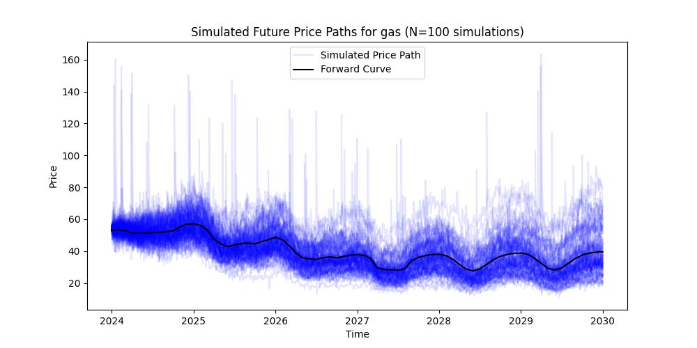
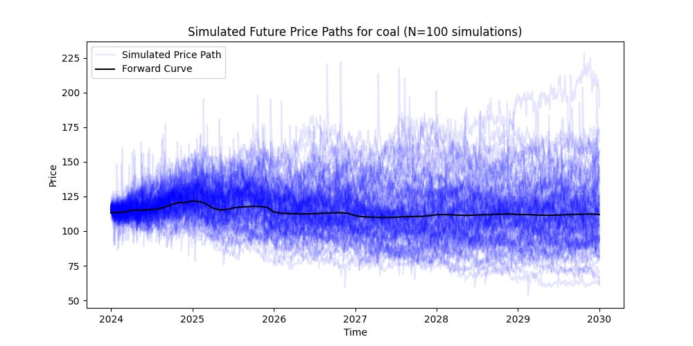
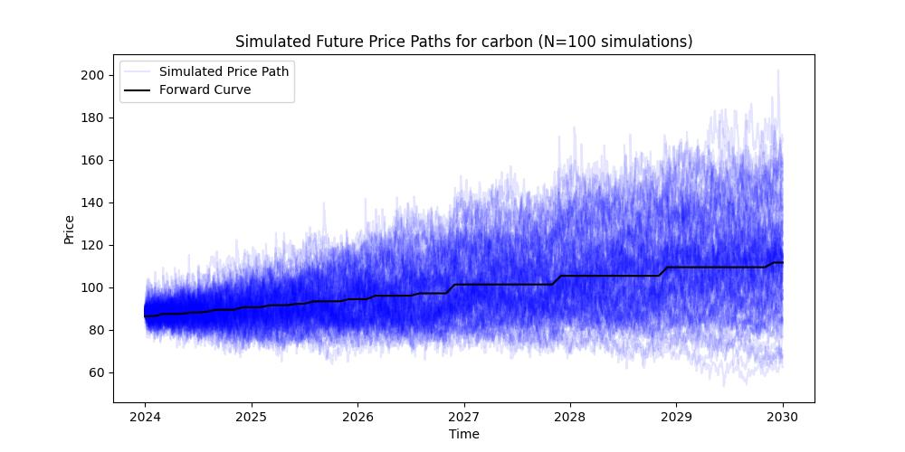

# Mean-Reversion Simulation for Gas, Coal, and CO₂
For modeling the prices of gas, coal, and carbon dioxide (CO$_2$), we employ a stochastic mean-reverting process. This method is grounded in the principle that these commodity prices, though subject to random fluctuations, tend to revert to their historical mean values over time.

The mean reversion rate for each commodity is estimated through linear regression, analyzing the logarithmic differences between the actual prices and their rolling mean values. This rate quantifies the speed at which prices revert to the mean, capturing the essential dynamics of the market's historical behavior.

$$Z_t = \ln(X_t) - \ln(y_t) = \alpha Z_{t-1} + \epsilon_t$$

In this equation, $X_t$ is the historical spot price of the commodity at time $t$, and $y_t$ is a rolling mean with a window of 28 days. The term $\alpha$ represents the mean reversion rate, and $\epsilon_t$ is the random shocks or fluctuations in price. We can also write the following equation for the rolling mean values:

$$\ln({\frac{y_t}{y_{t-1}}}) = \epsilon'_{t}$$

$$\ln(y_t) = \ln(y_{t-1}) + \epsilon'_t \rightarrow Z_t = \ln(X_t) - \ln(y_{t-1}) - \epsilon'_t$$

To simulate future price paths, we take randomly sampled residuals from our regression model. Furthermore, assuming $\epsilon'_{t} \sim N(0,\sigma)$, we generate random samples for $\epsilon'_{t}$. These residuals represent the random shocks or fluctuations in price, ensuring that each simulated path reflects potential real-world variability. Substituting $y_t$ with the forward curve $F_t$ and $X_t$ with $P_t$, gives us:\\
$$P_t = \exp\left(\ln\left({F_{t-1}}\right) + \alpha Z_{t-1} + \epsilon_t+ \epsilon'_{t}-\frac{1}{2}\sigma^2\right)$$

Where $P_t$ is the future spot prices, and $F_t$ is the future curve or the mean-level to which the natural logarithm of the spot price reverts. 

This stochastic modeling approach allows for the creation of multiple simulated future price paths, providing a range of scenarios for gas, coal, and CO$_2$ prices. This methodology is particularly useful for risk assessment and financial planning in markets where commodity prices are a critical factor. The graphs illustrate the simulated price scenarios for gas, coal, and carbon.

### Simulated Gas Data

### Simulated Coal Data

### Simulated Carbon Data

